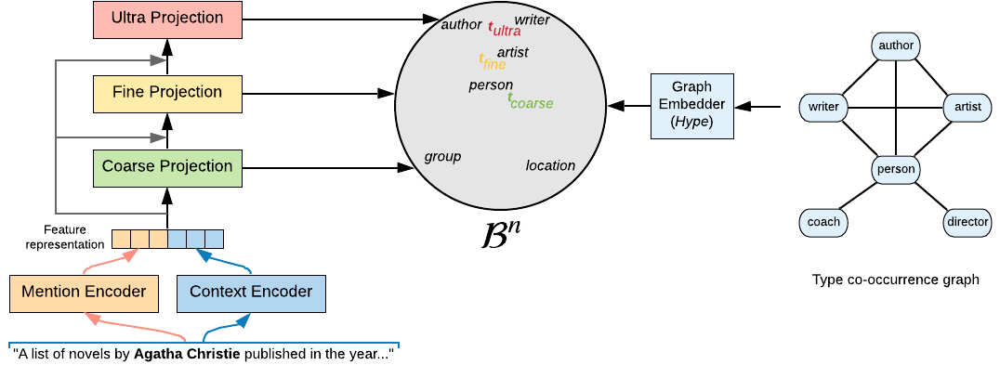

# Fine-Grained Entity Typing in Hyperbolic Space
Code for the paper ["Fine-Grained Entity Typing in Hyperbolic Space"](https://arxiv.org/abs/1906.02505) accepted at RepL4NLP @ ACL 2019

Model overview:
<p align="center"></p>

## Citation
The source code and data in this repository aims at facilitating the study of fine-grained entity typing. If you use the code/data, please cite it as follows:
```
@article{lopez2019hyperfiget,
  author    = {Federico L{\'{o}}pez and
               Benjamin Heinzerling and
               Michael Strube},
  title     = {Fine-Grained Entity Typing in Hyperbolic Space},
  journal   = {CoRR},
  volume    = {abs/1906.02505},
  year      = {2019},
  url       = {http://arxiv.org/abs/1906.02505},
  archivePrefix = {arXiv},
  eprint    = {1906.02505},
  timestamp = {Thu, 13 Jun 2019 13:36:00 +0200},
  biburl    = {https://dblp.org/rec/bib/journals/corr/abs-1906-02505},
  bibsource = {dblp computer science bibliography, https://dblp.org}
}
```

## Dependencies
* ``PyTorch 1.1``
* ``tqdm``
* ``tensorboardX``
* ``pyflann``

A conda environment can be created as well from the ``environment.yml`` file.

To embed the graphs into the different metric spaces the library [Hype](https://github.com/facebookresearch/poincare-embeddings/) was used. 

## Running the code

### 1. Download data
Download and uncompress Ultra-Fine dataset and GloVe word embeddings:
```
./scripts/figet.sh get_data
```

### 2. Preprocess data 
The parameter ``freq-sym`` can be replaced to store different preprocessing configurations: 
```
./scripts/figet.sh preprocess freq-sym
```

### 3. Train model
The name of the preprocessing used in the previous step must be given as a parameter.
```
./scripts/figet.sh train freq-sym
```

### 3. Do inference
```
./scripts/figet.sh inference freq-sym
```


## Acknowledgements
We thank to [Choi et al](https://homes.cs.washington.edu/~eunsol/papers/acl_18.pdf) for the release of the Ultra-Fine dataset and [their model](https://github.com/uwnlp/open_type).

## License

[MIT](LICENSE)
